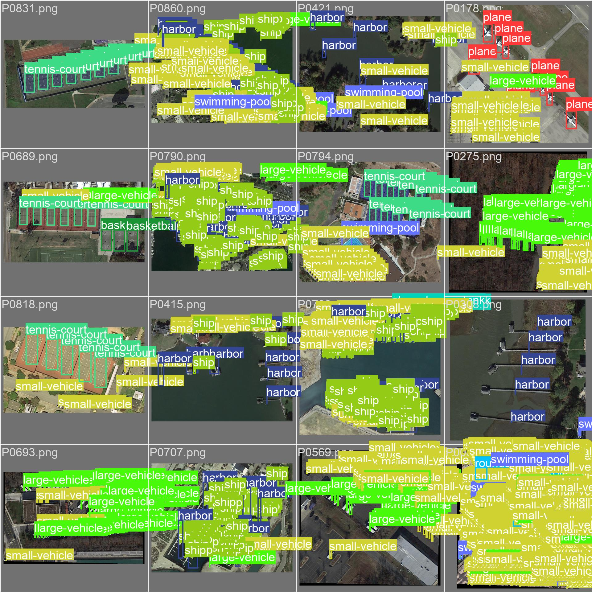

# yolov8-small-target-detection

基于yolov8实现小目标检测，在NWPU VHR-10和DOTA上测试

使用Gradio-YOLOv8-Det进行可视化

yolov8  https://github.com/ultralytics/ultralytics

Gradio-YOLOv8-Det  https://gitee.com/CV_Lab/gradio-yolov8-det

可视化需要执行gradio_yolov8_det下的gradio_yolov8_det_v2.py。

根据要求修改/model_config/model_name_all.yaml以添加自己的模型权值

修改/cls_name/cls_name_zh.yaml以修改目标检测的标签值

## 文件结构

    yolov8/
    |
    |--- datasets/                  # 存放数据集
    |   |--- DOTAs/                 # DOTA 数据集
    |   |--- NWPUVHR/               # NWPU VHR-10 数据集
    |
    |--- gradio_yolov8_det/         # 模型结果可视化模块
    |
    |--- yolov8fornwpuvhr.pt        # 在 NWPU VHR-10 上训练好的模型权重
    |--- yolov8.yaml                # 网络配置文件（可修改类别数 nc）
    |
    |--- train.py                   # 训练脚本：用于在 NWPU VHR-10 数据集上训练
    |--- train_DOTAs.py             # 训练脚本：用于在 DOTA 数据集上训练
    |--- pred.py                    # 模型评估脚本
    |
    |# github.com/ultralytics/ultralytics/    # YOLOv8 官方源码仓库
    |--- docker/                # Docker 相关文件
    |--- docs/                  # 文档资料
    |--- examples/              # 示例代码
    |--- ultralytics/           # 核心代码目录

## 可视化示意

原图

检测结果

在NWPU VHR-10数据集表现

原标签

在DOTA数据集表现

原标签

目前来看在DOTA上表现不好，这可能是由于在DOTA上进行标签转换时没有处理好旋转框，导致模型不能很好的学到较小的目标。
下面是修改了标签计算方法的训练结果。

原标签

Gradio-YOLOv8-Det的原作者  曾逸夫, (2024) Gradio YOLOv8 Det (Version 2.1.0).https://gitee.com/CV_Lab/gradio-yolov8-det.git.

## 在DOTA数据集上处理旋转框

在./datasets/DOTAs/dota.py中采用外接矩形法

DOTA的标签如

    magesource:GoogleEarth
    gsd:0.146343590398
    2244.0 1791.0 2254.0 1795.0 2245.0 1813.0 2238.0 1809.0 small-vehicle 1

在 convert_label_to_yolo 函数中，先忽略前两行，然后解析每个对象的顶点坐标。

使用OpenCV的 cv2.minAreaRect 和 cv2.boxPoints 计算最小外接矩形。

通过计算这个外接矩形的中心点、宽度和高度，并将其归一化后形成YOLO格式的标签 class_index x_center y_center width height。

我原来是通过类似内接矩形的方法直接处理的，计算对角线的交点作为中心，
对于这样的小目标而言，在旋转框中内接矩形会丢掉目标的信息，而外接矩形会引入额外的背景。

其中蓝色为原来的标签，绿色为我开始得到的标签，红色为外接矩形的标签。

## 运行

参照文件说明，下载解压好文件，在根目录下运行：

    # DOTA数据集标签转换
    python datasets/DOTAs/dota.py
    # 划分训练集/测试集/验证集
    python datasets/DOTAs/testsplit.py
    # 得到训练集/测试集/验证集的txt文件
    python datasets/DOTAs/ll.py
    # 训练
    python train_DOTAs.py
    # 模型评估
    python pred_DOTAs.py

    # NWPU VHR-10数据集标签转换
    python datasets/NWPUVHR/nwpu.py
    # 划分训练集/测试集/验证集
    python datasets/NWPUVHR/testsplit.py
    # 获取训练集/测试集/验证集的txt文件
    python datasets/NWPUVHR/ll.py
    # 训练
    python train.py

